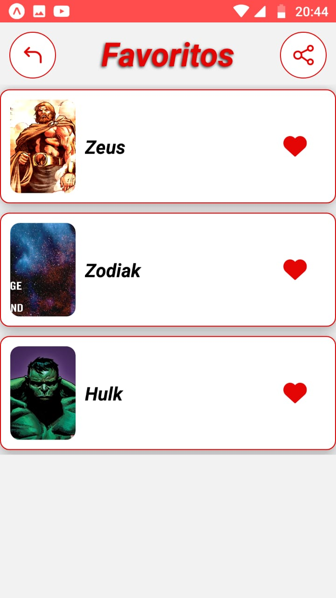

## *** Marvel - APP ***

### Aplicativo desenvolvido em React Native utilizando a ferramenta Expo.

## Screens
| | | |
|:-------------------------:|:-------------------------:|:-------------------------:|
|  |   | 
|   |   |   | 

### Configuração básica

<strong>INSIRA SUA CHAVE PUBLIC E PRIVADA</strong> arquivo constants.js - src/utils 

Para executar a demonstração do App: clone repo e `cd marvel` em seguinda rode a aplicação com o comando `npm install || yarn install && expo start`, para rodar o aplicativo no smartphone físico será necessário instalar o APP do Expo.

* Android - https://play.google.com/store/apps/details?id=host.exp.exponent&hl=pt_BR&gl=US
* IOS - https://apps.apple.com/br/app/expo-go/id982107779

